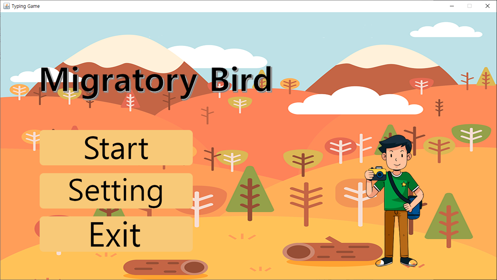
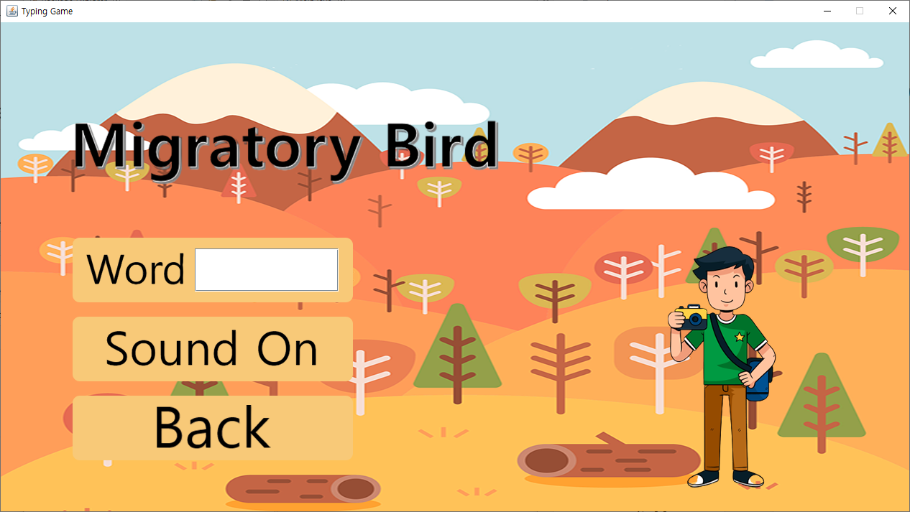
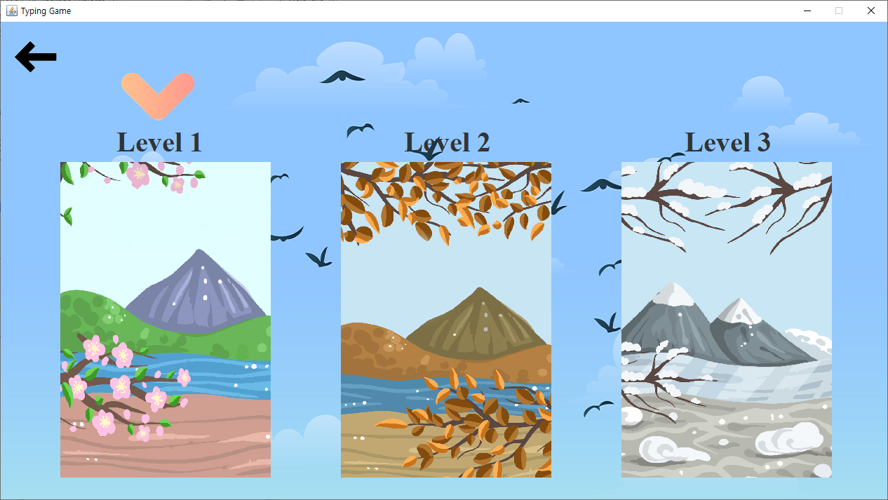
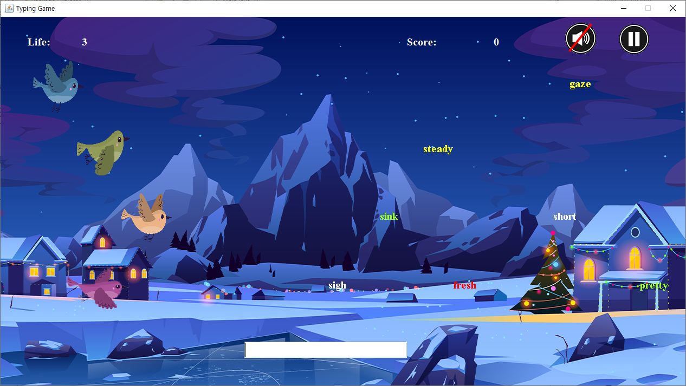
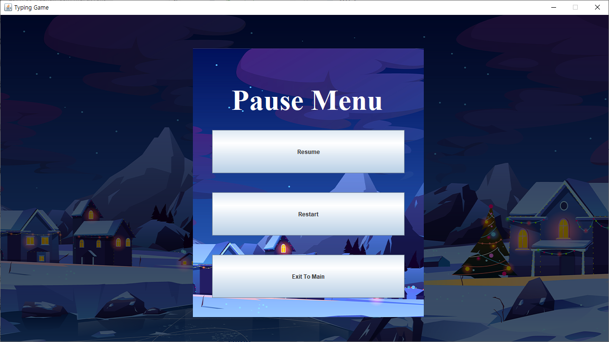
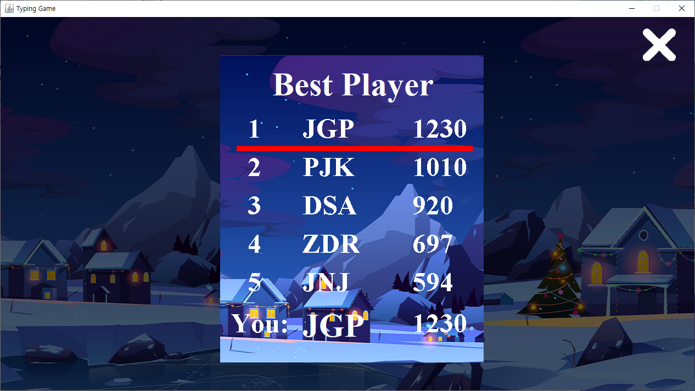

# TypingGame-Java
한성대학교 객체지향언어2(Java) 개인 프로젝트 작품입니다  
(2020/12/20)

 

### 메인화면

 

### 세팅화면

- 빈 칸안에 단어를 입력하면 연결되어 있는 단어장에 저장됩니다.
- Sound버튼을 통해 소리를 제어할 수 있습니다.

 

### 레벨선택화면

- 키보드 방향키 버튼을 통해 화살표 이동이 가능합니다.
- space바 입력을 통해 단계가 선택되도록 하였습니다.

 

### 게임화면

- 기본 글자는 10점/ 이벤트 글자는 100점을 지급합니다.
- 새에 부딪히면 라이프가 감소됩니다.
- 빨간색 글자: 화면의 글자들이 전부 사라지게 하는 폭탄역할.
- 노란색 글자: 글자들을 멈추게 하는 역할
- 초록색 글자: 일정시간동안 X2배

### Pause화면

- pause버튼을 누르면 화면이 뜹니다.
- 게임의 분위기를 살리기 위해 뒷 배경이 보이게 투명색으로 설정했습니다.

### RANK화면

- 5등 안에 점수가 들면 이니셜을 입력할 수 있습니다.
- 입력했을 때 몇 등에 표시되었는지 빨간줄로 강조했습니다.